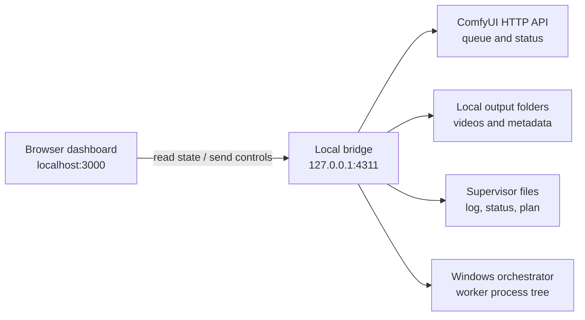

# LTX / Watch


**LTX / Watch** is a private, local-first dashboard for monitoring LTX Video jobs running through ComfyUI. The Studio branch adds a human-in-the-loop workspace where each shot is generated, reviewed, corrected, and explicitly accepted before moving forward.

The app runs entirely on your computer. It does not upload prompts, videos, logs, or credentials.

> This is an independent community project. It is not affiliated with or endorsed by Lightricks or the ComfyUI project.

## Highlights

- Live active-track, shot, stage, elapsed-time, and remaining-time estimates
- Planned-job queue plus ComfyUI running/pending queue status
- GPU utilization and allocated-memory telemetry
- Searchable final-video and raw-clip history
- MP4/WebM/MOV/MKV playback directly in the browser
- One-click **Show in Explorer** actions
- Windows process-tree pause/resume that preserves the current shot and VRAM
- Auto-refreshing activity timeline parsed from generator events
- Editable source paths, model label, worker match, and refresh interval
- Loopback-only local bridge with an ephemeral control token
- Optional **LTX Watch Studio** shot-by-shot review mode
- Per-attempt correction notes and preserved regeneration history
- Selectable Studio scene queue with one-click **Move first** ordering

## Requirements

- Windows 10 or Windows 11
- Node.js `22.13.0` or newer
- npm
- A local ComfyUI installation
- An LTX workflow that writes video files to a local output directory
- Optional: `ffprobe.exe` in the ComfyUI root for duration and resolution metadata

The history and standard queue features work with ordinary ComfyUI output folders. The richest track/shot progression view uses the optional supervisor files described in [LTX compatibility](docs/LTX_COMPATIBILITY.md).

## Quick start

```powershell
git clone https://github.com/Orffyrus-Qc/ltx-watch.git
cd ltx-watch
npm install
npm run dev
```

Open <http://localhost:3000>. On Windows, you can also double-click **Start LTX Watch.bat** after installing dependencies.

### Studio branch test launch

Studio is developed on the `feature/ltx-watch-studio` branch and can run beside the normal dashboard without replacing it:

```powershell
git switch feature/ltx-watch-studio
npm install
npm run dev:studio
```

Open <http://localhost:3001>. Its local bridge uses `127.0.0.1:4312`; the normal Watch ports remain 3000/4311. Studio can be browsed while a batch is active, but its Generate button remains safely locked until the album worker and configured ComfyUI port are idle.

LTX / Watch searches common ComfyUI locations automatically:

- `%USERPROFILE%\ComfyUI`
- `C:\ComfyUI`
- `C:\AI\ComfyUI`
- `D:\ComfyUI`
- `D:\AI\ComfyUI`

If your installation is elsewhere, open **Settings** in the dashboard or create a local configuration file:

```powershell
Copy-Item local.config.example.json local.config.json
```

Then edit `local.config.json`. It is intentionally ignored by Git.

## Windows installer

The prebuilt MSI is self-contained: it bundles a production build and a private Node.js runtime, so end users do not need to install Node or npm. It installs per-user under `%LOCALAPPDATA%\Programs\LTX Watch` and creates Desktop and Start Menu shortcuts.

To build the installer from source:

```powershell
npm install
npm run build:msi
```

The build requires Node.js, npm, the .NET SDK, and internet access on its first run. It restores **WiX Toolset 6.0.2** into `installer/.tools`, bundles the current `node.exe` plus its official license, and writes the result to `release/LTX-Watch-<version>-x64.msi`. Build and release folders are intentionally ignored by Git.

The generated MSI is not code-signed. Windows may show an unknown-publisher warning until the package is signed with a trusted Authenticode certificate.

## Configuration

| Field | Purpose | Typical value |
| --- | --- | --- |
| `displayName` | Greeting shown in the header | `Creator` |
| `modelLabel` | Model/version label shown in the UI | `LTX Video 2.5` |
| `workerCommandFragment` | Text used to verify the worker before process control | `run_full_album_auto.py` |
| `recoveryScript` | Supervisor script used to retry an interrupted shot after reboot | `run_dual_gpu_album.py` |
| `studioSourceRunner` | Compatible album runner reused for single-shot generation | `C:\ComfyUI\run_full_album_auto.py` |
| `studioGpu` | CUDA device used by Studio | `0` |
| `studioPort` | Temporary ComfyUI port used by Studio | `8188` |
| `comfyRoot` | ComfyUI installation root | `C:\ComfyUI` |
| `finalsDirectory` | Finished/assembled videos | `C:\ComfyUI\output\assembled` |
| `clipsDirectory` | Raw generated clips | `C:\ComfyUI\output\video` |
| `logFile` | Optional generator progress log | `C:\ComfyUI\full_album_auto_run.log` |
| `statusFile` | Optional supervisor/GPU status JSON | `C:\ComfyUI\dual_gpu_status.json` |
| `planFile` | Optional planned-track queue JSON | `C:\ComfyUI\dual_gpu_split.json` |
| `comfyUrl` | Local ComfyUI HTTP address | `http://127.0.0.1:8188` |
| `refreshSeconds` | Dashboard polling interval | `5` |
| `maxVideos` | Maximum indexed videos returned to the UI | `120` |

Environment variables can override the initial auto-detected values:

```powershell
$env:LTX_WATCH_COMFY_ROOT = 'E:\Apps\ComfyUI'
$env:LTX_WATCH_COMFY_URL = 'http://127.0.0.1:8188'
$env:LTX_WATCH_MODEL_LABEL = 'LTX Video 2.5'
$env:LTX_WATCH_NAME = 'Creator'
npm run dev
```

Saved dashboard settings in `local.config.json` take precedence over auto-detected defaults.

## LTX Watch Studio workflow

Studio is a deliberate review loop rather than an unattended batch:

1. Open **Studio** from the sidebar.
2. Select any waiting scene. Use **Move first** to put it at the front of Studio's persistent queue.
3. Generate the current shot, or review an existing compatible output.
4. If the result needs work, describe the correction and press **Regenerate shot**.
5. Studio archives the previous attempt locally and generates the same shot from frame one with the correction appended to its prompt.
6. Press **Accept & next shot** only when satisfied. Studio records the accepted attempt and advances to the next unaccepted shot.
7. After the final shot is accepted, Studio advances to the next queued scene. The normal album runner can later skip the accepted clip files and assemble the scene.

Correction notes and Studio state are stored only in ignored local runtime files. Prompt text is passed through a private JSON job file, not a process command line or URL. Rejected videos are preserved under `.ltx-watch-studio/attempts` and remain playable from the review history.

### Queue behavior

**Move first** changes Studio's own queue overlay; it does not rewrite `dual_gpu_split.json` or mutate the command line of a supervisor that is already running. This is intentional: changing a live batch assignment could duplicate work or compete for a GPU. Once the batch worker finishes, Studio processes scenes in the saved Studio order.

### Generation safety

Studio refuses to launch a shot when any of these are true:

- A worker PID from the configured status file is alive.
- The configured ComfyUI port is responding.
- Another Studio shot is active.
- The source runner or ComfyUI Python environment cannot be validated.

The Python adapter also acquires the source runner's port lock before starting ComfyUI. Automated tests use a fake runner and never invoke a real model.

## How it works



Two local services start together:

1. The Vinext/React dashboard on `localhost:3000`.
2. A Node.js bridge on `127.0.0.1:4311` that can safely read local files, stream videos with HTTP range requests, query ComfyUI, open Explorer, and control the generator process tree.

The bridge binds to loopback only. Control requests require a random token generated for each bridge session; the token is never written to disk.

## Pause and resume

**Pause render** suspends the configured LTX worker and all of its active child processes. **Resume render** reverses that suspension. The operation does not kill, interrupt, or restart ComfyUI.

Important behavior:

- The current shot remains in memory.
- GPU memory remains allocated while paused.
- The paused state is saved locally, so closing the browser does not resume the job.
- Restarting only LTX / Watch preserves the suspended worker; press **Resume render** to continue in place.
- A Windows restart destroys the suspended process. LTX / Watch detects this and changes the button to **Retry interrupted shot**.
- Recovery archives any video file already written for the interrupted shot under `<ComfyUI>\.ltx-watch-recovery`, launches `recoveryScript` in the background, and regenerates that same shot from the beginning. Earlier completed shots are left untouched.
- The controller verifies `workerCommandFragment` before touching a process, reducing the risk of PID reuse targeting an unrelated program.
- Automated tests must never pause a real generator; see [AGENTS.md](AGENTS.md).

The process orchestrator is Windows-specific because it uses native `NtSuspendProcess` and `NtResumeProcess` calls through PowerShell.

## Data sources and compatibility

LTX / Watch intentionally separates standard ComfyUI data from project-specific supervisor data:

| Layer | Source | Used for |
| --- | --- | --- |
| Standard | `GET /queue` | Live ComfyUI running/pending counts |
| Standard | Local video folders | History, playback, sizes, timestamps |
| Optional | Progress log | Track, shot, stage, estimates, activity |
| Optional | Status JSON | Worker PID and GPU snapshot |
| Optional | Plan JSON | Planned track queue and shot counts |

See [docs/LTX_COMPATIBILITY.md](docs/LTX_COMPATIBILITY.md) for accepted schemas, log events, filename conventions, and the update procedure for a future LTX or ComfyUI release.

## Local API

The bridge is an implementation detail, but these endpoints define the dashboard contract:

| Method | Endpoint | Description |
| --- | --- | --- |
| `GET` | `/api/health` | Bridge health |
| `GET` | `/api/state` | Aggregated job, queue, video, GPU, and control state |
| `GET` | `/api/config` | Effective local configuration |
| `POST` | `/api/config` | Save local configuration |
| `POST` | `/api/control` | Pause or resume the verified worker tree |
| `POST` | `/api/studio` | Select/reorder scenes, generate one shot, or accept the reviewed output |
| `POST` | `/api/open` | Open a configured file/folder in Explorer |
| `GET` | `/media/:id` | Range-enabled local video stream |

`/api/control` requires the per-session `X-LTX-Control-Token` returned inside `/api/state`. Do not expose the bridge to a network interface.

## Project structure

```text
app/
  dashboard.tsx              React dashboard and interactions
  globals.css                Visual system and responsive layout
  layout.tsx                 Page metadata and fonts
local-server.mjs             Local aggregation, streaming, and control API
scripts/
  ltx-studio-runner.py       One-shot adapter for a compatible local runner
  process-orchestrator.ps1   Windows process-tree suspend/resume
  run-local.mjs              Starts the dashboard and bridge together
  run-studio.mjs             Starts isolated Studio development ports
studio-core.mjs              Queue and review-state invariants
docs/
  AI_MAINTAINER_GUIDE.md     Safe workflow for coding agents
  LTX_COMPATIBILITY.md       Adapter contract and upgrade checklist
local.config.example.json    Shareable configuration template
Start LTX Watch.bat          Windows launcher
```

## Development

```powershell
npm install
npm run dev
```

Validation commands:

```powershell
node --check local-server.mjs
node --check scripts/run-local.mjs
npm run build
```

When testing pause/resume, use a temporary CPU-loop process. Never test process control against a live render unless the user explicitly asks to pause it.

## Updating for a new LTX release

Most model-only updates require changing `modelLabel` and no code. If the surrounding ComfyUI workflow, filenames, queue payloads, logs, or runner process change:

1. Read [docs/LTX_COMPATIBILITY.md](docs/LTX_COMPATIBILITY.md).
2. Capture sanitized examples of the new queue response, log events, status JSON, plan JSON, and output filenames.
3. Update only the affected adapter boundary in `local-server.mjs`.
4. Preserve the `/api/state` response contract used by `app/dashboard.tsx`.
5. Test parsing and video streaming without controlling a real render.
6. Validate native pause/resume on a temporary process.
7. Update the model label, compatibility notes, README, and changelog.

Coding agents should start with [AGENTS.md](AGENTS.md) and [docs/AI_MAINTAINER_GUIDE.md](docs/AI_MAINTAINER_GUIDE.md). Those documents contain safety constraints, code ownership boundaries, and an exact release-upgrade checklist.

## Troubleshooting

### The dashboard says “Bridge offline”

Run the complete local command, not the site-only command:

```powershell
npm run dev
```

`npm run site:dev` starts only the web UI and cannot read local outputs.

### Videos do not appear

- Confirm `finalsDirectory` and `clipsDirectory` in Settings.
- Confirm the files use `.mp4`, `.webm`, `.mov`, or `.mkv`.
- Confirm each completed file is larger than 100 KB.
- Increase `maxVideos` if older files are outside the index limit.

### Queue or progress is empty

- Standard ComfyUI queue data requires `comfyUrl` to be reachable.
- Detailed track/shot data requires a compatible `logFile`.
- Planned jobs require a compatible `planFile`.
- The video library still works when those optional sources are absent.

### Pause is disabled

- `statusFile` must expose a current worker PID.
- `workerCommandFragment` must match the worker command line.
- The worker must still be running under the same Windows user.

### Video metadata is missing

Place `ffprobe.exe` in the configured ComfyUI root. Playback does not require FFprobe.

## Privacy and security

- The bridge listens only on `127.0.0.1`.
- Local paths and runtime state are excluded from Git.
- Media IDs are encoded paths, but the bridge validates every decoded path against configured output roots.
- Explorer requests are restricted to configured local folders.
- Control requests require an ephemeral token.
- No telemetry or remote analytics are included.

Do not commit `local.config.json`, `.env` files, generated videos, ComfyUI logs, supervisor status files, or `orchestrator.state.json`.

## Official upstream projects

- [Lightricks/LTX-2](https://github.com/Lightricks/LTX-2)
- [Lightricks/ComfyUI-LTXVideo](https://github.com/Lightricks/ComfyUI-LTXVideo)
- [Comfy-Org/ComfyUI](https://github.com/Comfy-Org/ComfyUI)
- [ComfyUI OpenAPI specification](https://github.com/Comfy-Org/ComfyUI/blob/master/openapi.yaml)

Before upgrading model weights or workflows, review the applicable upstream model license and release notes. This repository does not bundle LTX models, weights, ComfyUI, or generated media.
