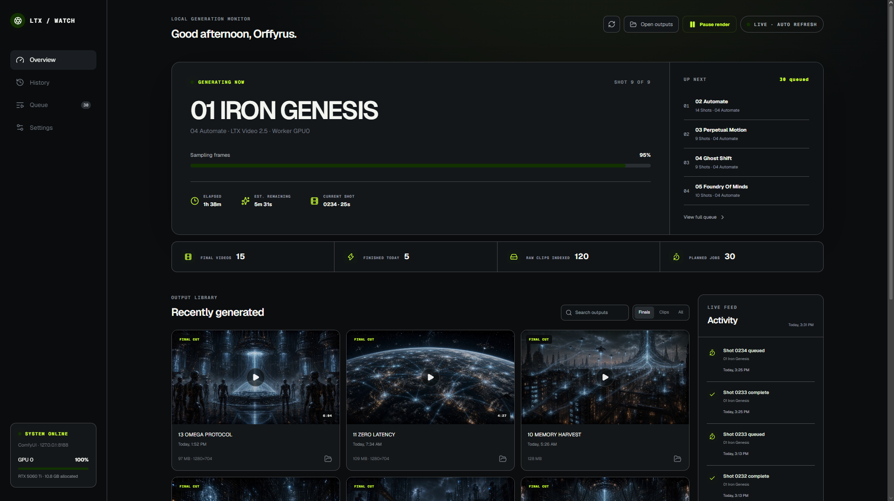
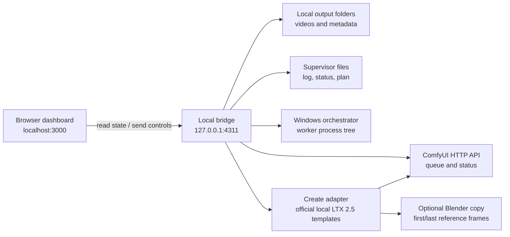

# LTX / Watch




**LTX / Watch** is a private, local-first dashboard and production workspace for LTX Video jobs running through ComfyUI. It includes a human-in-the-loop Studio where each shot is generated, reviewed, corrected, and explicitly accepted before moving forward.

The app runs entirely on your computer. It does not upload prompts, videos, logs, or credentials.

> This is an independent community project. It is not affiliated with or endorsed by Lightricks or the ComfyUI project.

## Highlights

- Live active-track, shot, stage, elapsed-time, and remaining-time estimates
- Planned-job queue plus ComfyUI running/pending queue status
- Live NVIDIA GPU utilization and used-memory telemetry, with a clearly labeled supervisor-snapshot fallback
- Searchable final-video and raw-clip history
- MP4/WebM/MOV/MKV playback directly in the browser, with continuous cached H.264 playback for assembled finals
- One-click **Show in Explorer** actions
- Windows process-tree pause/resume that preserves the current shot and VRAM
- Auto-refreshing activity timeline parsed from generator events
- Read-only Environment Doctor for ComfyUI, LTX models, Python packages, Git revisions, disks, video tools, and NVIDIA GPUs
- Guarded one-click SAM 3.1 checkpoint installation plus native-node readiness and GPU-role recommendations
- One-click guarded installation and configuration of the official ComfyUI-Blender integration
- Editable source paths, model label, worker match, and refresh interval
- Loopback-only local bridge with an ephemeral control token
- Integrated **LTX Watch Studio** shot-by-shot review mode
- Experimental **Create** workspace for original local LTX 2.5 text-to-video, image-to-video, and first/last-frame generation
- Unified private drag-and-drop context tray for images, videos, songs, and `.blend` scenes
- Optional Blender-backed reference frames rendered from an immutable copy of a project backbone
- Optional Blender-authoritative physics packages with beauty, depth, normal, motion-vector, and camera passes
- Private persistent Create drafts, variation queue, live progress, active-render cancellation, playback, recoverable output deletion, retry, pause-between-jobs, and **Move first** ordering
- Per-attempt correction notes and preserved regeneration history
- Selectable Studio scene queue with one-click **Move first** ordering
- Project Library imports an existing folder by reference or into an app-managed copy
- Visual multi-shot selection, acceptance state, context attachments, and persistent selective-regeneration queue
- Live regeneration stage, progress percentage, elapsed time, and estimated remaining time in the Projects queue
- First-class Blender/3D assets with one designated project backbone scene for shared cameras, blocking, and spatial continuity

## Requirements

- Windows 10 or Windows 11
- Node.js `22.13.0` or newer
- npm
- A local ComfyUI installation
- An LTX workflow that writes video files to a local output directory
- ComfyUI's official local `video_ltx2_5_t2v`, `video_ltx2_5_i2v`, and `video_ltx2_5_flf2v` workflow templates for the matching Create modes
- Optional: `ffprobe.exe` in the ComfyUI root for duration and resolution metadata
- FFmpeg in the ComfyUI root or system path for dropped video/audio context and assembled-final browser compatibility copies
- Optional: Blender 4.5 or Blender 5 for the ComfyUI-Blender integration

The history and standard queue features work with ordinary ComfyUI output folders. The richest track/shot progression view uses the optional supervisor files described in [LTX compatibility](docs/LTX_COMPATIBILITY.md).

## Quick start

```powershell
git clone https://github.com/Orffyrus-Qc/ltx-watch.git
cd ltx-watch
npm install
npm run dev
```

Open <http://localhost:3000>. On Windows, you can also double-click **Start LTX Watch.bat** after installing dependencies.

### Isolated development launch

Studio and Projects are included in the normal application at <http://localhost:3000>. Contributors can also run the same application on isolated development ports so it can remain open beside another LTX Watch instance:

```powershell
npm run dev:studio
```

Open <http://localhost:3001>. Its local bridge uses `127.0.0.1:4312`; the standard ports remain 3000/4311. Studio can be browsed while a batch is active, but its Generate button remains safely locked until the album worker and configured ComfyUI port are idle.

LTX / Watch searches common ComfyUI locations automatically:

- `%USERPROFILE%\ComfyUI`
- `C:\ComfyUI`
- `C:\AI\ComfyUI`
- `D:\ComfyUI`
- `D:\AI\ComfyUI`

If your installation is elsewhere, open **Settings** in the dashboard or create a local configuration file:

```powershell
Copy-Item local.config.example.json local.config.json
```

Then edit `local.config.json`. It is intentionally ignored by Git.

## Windows installer

The prebuilt MSI is self-contained: it bundles a production build and a private Node.js runtime, so end users do not need to install Node or npm. It installs per-user under `%LOCALAPPDATA%\Programs\LTX Watch` and creates Desktop and Start Menu shortcuts.

[Download the latest Windows MSI](https://github.com/Orffyrus-Qc/ltx-watch/releases/latest)

To build the installer from source:

```powershell
npm install
npm run build:msi
```

The build requires Node.js, npm, the .NET SDK, and internet access on its first run. It restores **WiX Toolset 6.0.2** into `installer/.tools`, bundles the current `node.exe` plus its official license, and writes the result to `release/LTX-Watch-<version>-x64.msi`. Build and release folders are intentionally ignored by Git.

The generated MSI is not code-signed. Windows may show an unknown-publisher warning until the package is signed with a trusted Authenticode certificate.

## Configuration

| Field | Purpose | Typical value |
| --- | --- | --- |
| `displayName` | Greeting shown in the header | `Creator` |
| `modelLabel` | Model/version label shown in the UI | `LTX Video 2.5` |
| `workerCommandFragment` | Text used to verify the worker before process control | `run_full_album_auto.py` |
| `recoveryScript` | Supervisor script used to retry an interrupted shot after reboot | `run_dual_gpu_album.py` |
| `studioSourceRunner` | Compatible album runner reused for single-shot generation | `C:\ComfyUI\run_full_album_auto.py` |
| `studioGpu` | CUDA device used by Studio | `0` |
| `studioPort` | Temporary ComfyUI port used by Studio | `8188` |
| `comfyRoot` | ComfyUI installation root | `C:\ComfyUI` |
| `finalsDirectory` | Finished/assembled videos | `C:\ComfyUI\output\assembled` |
| `clipsDirectory` | Raw generated clips | `C:\ComfyUI\output\video` |
| `logFile` | Optional generator progress log | `C:\ComfyUI\full_album_auto_run.log` |
| `statusFile` | Optional supervisor/GPU status JSON | `C:\ComfyUI\dual_gpu_status.json` |
| `planFile` | Optional planned-track queue JSON | `C:\ComfyUI\dual_gpu_split.json` |
| `comfyUrl` | Local ComfyUI HTTP address | `http://127.0.0.1:8188` |
| `refreshSeconds` | Dashboard polling interval | `5` |
| `maxVideos` | Maximum indexed videos returned to the UI | `120` |

Environment variables can override the initial auto-detected values:

```powershell
$env:LTX_WATCH_COMFY_ROOT = 'E:\Apps\ComfyUI'
$env:LTX_WATCH_COMFY_URL = 'http://127.0.0.1:8188'
$env:LTX_WATCH_MODEL_LABEL = 'LTX Video 2.5'
$env:LTX_WATCH_NAME = 'Creator'
npm run dev
```

Saved dashboard settings in `local.config.json` take precedence over auto-detected defaults.

## Create original videos from text

**Create** is a separate workspace and does not require an existing album plan or shot number:

1. Describe the scene and optionally add a title and an **Avoid** list. Avoid notes are written as production constraints so the model is not asked to speak them.
2. Choose 3–20 seconds, a generation-friendly resolution, 12–30 fps, one to four variations, and a random or repeatable seed.
3. Optionally enable local prompt enhancement, camera direction, motion intensity, visual style, and synchronized, ambience-only, soundtrack-replacement, or stripped audio.
4. Drop images, video, a song, or a `.blend` into **Context Drop**, or start from text alone. The first two images become start/end anchors; a video supplies extracted first/end frames; audio replaces the finished video's soundtrack; and a `.blend` becomes the private Blender backbone.
5. Blender mode can use either a `.blend` backbone assigned in **Projects** or a dropped `.blend`. **Creative anchors** copies the scene, renders selected timeline frame(s), and passes those PNGs to the official local I2V or FLF2V workflow. It never saves over the source scene.
6. Choose **Blender animation** directly in **Visual Backbone** when Blender must own the complete shot. Select a frame range and LTX Watch evaluates the copied scene sequentially into a versioned package containing RGBA beauty frames, linear depth, surface normals, motion vectors, and per-frame camera transforms. Camera and motion controls are locked because Blender—not LTX—owns animation. **Blender frames** remains the creative alternative that sends only first/end frames to LTX.
7. Press **Queue creation** for LTX output or **Prepare backbone** for strict physics passes. Jobs run one at a time only after the album worker, Studio, Projects regeneration, and the configured ComfyUI port are idle.

Create state, prompts, uploads, runner logs, and job JSON live in ignored `create.state.json` and `.ltx-watch-create/`. Only the ignored JSON job path appears on the Python process command line. Outputs are written beneath the configured ComfyUI video folder and remain playable from Create history.

Each completed Create card can rename its local video, show it in Explorer, play it, or delete it after confirmation. Rename changes the displayed title and filename together, preserves the media extension, and refuses to overwrite an existing file. Delete revalidates the job's server-stored output path and moves the video to the Windows Recycle Bin before removing the history card.

Context files remain local. Dropped audio is not visual conditioning: it is looped or trimmed to the generated video's length and replaces the generated audio track after rendering. Dropped video is currently reduced to first/end visual anchors rather than used as full motion conditioning.

The queue **Pause** control stops automatic launch of the next waiting creation; it does not suspend an active sampling process. **Cancel render** asks the owning Create runner to interrupt only the isolated ComfyUI server it launched, then releases the normal lock and records a retryable Canceled result. Use **Move first** to reprioritize a waiting variation and **Retry** for a failed or canceled job. Automated checks must never press **Queue creation**, cancel a real render, or call the authenticated enqueue action against a real local bridge.

### Blender animation backbone and the LTX 2.5 gate

Physics mode deliberately stops after preparing the Blender backbone package on the current supported stack. The installed official LTX 2.5 T2V/I2V/FLF2V templates do not expose a verified contract that consumes depth, normals, and motion vectors together while guaranteeing that model sampling cannot invent or retime motion. Calling a first/last-frame workflow “physics-preserving” would be misleading.

The package manifest therefore records `animationAuthority: "blender"`, `refinementAuthority: "appearance-only"`, source provenance, timeline, resolution, dynamics inventory, pass patterns, and `refinementReady: false`. Once an official compatible 2.5 control workflow is verified, a versioned refinement adapter can consume this package. It must treat any geometry, trajectory, collision, cloth, deformation, camera, or timing drift as a failed result. LTX Watch does not silently fall back to an older LTX control model or another video backend.

## LTX Watch Studio workflow

Studio is a deliberate review loop rather than an unattended batch:

1. Open **Studio** from the sidebar.
2. Select any waiting scene. Use **Move first** to put it at the front of Studio's persistent queue.
3. Generate the current shot, or review an existing compatible output.
4. If the result needs work, describe the correction and press **Regenerate shot**.
5. Studio archives the previous attempt locally and generates the same shot from frame one. Corrections are wrapped as non-spoken director notes so characters do not repeat production instructions. To request exact speech, put `DIALOGUE:` at the beginning of a separate line.
6. Press **Accept & next shot** only when satisfied. Studio records the accepted attempt and advances to the next unaccepted shot.
7. After the final shot is accepted, Studio advances to the next queued scene. The normal album runner can later skip the accepted clip files and assemble the scene.

Correction notes and Studio state are stored only in ignored local runtime files. Prompt text is passed through a private JSON job file, not a process command line or URL. Rejected videos are preserved under `.ltx-watch-studio/attempts` and remain playable from the review history.

### Queue behavior

**Move first** changes Studio's own queue overlay; it does not rewrite `dual_gpu_split.json` or mutate the command line of a supervisor that is already running. This is intentional: changing a live batch assignment could duplicate work or compete for a GPU. Once the batch worker finishes, Studio processes scenes in the saved Studio order.

### Generation safety

Studio refuses to launch a shot when any of these are true:

- A worker PID from the configured status file is alive.
- The configured ComfyUI port is responding.
- Another Studio shot is active.
- The source runner or ComfyUI Python environment cannot be validated.

The Python adapter also acquires the source runner's port lock before starting ComfyUI. Automated tests use a fake runner and never invoke a real model.

## Project Library and Blender backbone

Open **Projects** to turn an output folder or edit folder into a persistent local production workspace:

1. Choose **Import project** and enter an absolute folder path.
2. Use **Reference in place** to leave files untouched, or **Copy supported assets** to make a managed local working copy.
3. Watch indexes video, stills, audio, text prompts, subtitles, JSON/YAML/TOML metadata, Blender scenes, and common 3D interchange files.
4. Files with a leading shot number or `shot_####` name are grouped into shots and versions. A parent folder matching either the active plan or a scene reported by the compatible Studio source runner makes that shot eligible for LTX regeneration. This keeps completed/assembled scenes available for later one-shot corrections without putting the whole scene back into the album queue.
5. Select any number of mapped shots, enter one non-spoken director note, and add them to the persistent regeneration queue. Use a separate `DIALOGUE:` line only when exact spoken words are intended. Pause/resume applies to this queue between shots; it never interrupts a shot already running.
6. Upload reference/context files in the browser, select them in the inspector, and attach them to one or more shots.
7. Mark reviewed shots accepted or return them to review without deleting any media.

Project state lives in ignored `projects.state.json`; managed copies and uploads live under ignored `.ltx-watch-projects`. Reference imports store paths only and never move source files. The bridge serves previews and Explorer actions only after validating paths against registered project roots.

Source-runner inspection returns scene names, slugs, and shot numbers only. It does not queue work, start ComfyUI, read prompt text, or make an assembled scene part of the unattended Studio queue. A regeneration starts only after the user explicitly submits a mapped shot from Projects and the normal worker/ComfyUI safety locks are clear.

### Blender production backbone

`.blend`, USD, FBX, OBJ, and GLTF/GLB files are first-class project assets. Choose one as the **Blender backbone** to record which scene owns the production camera, animation blocking, spatial layout, and continuity. Per-shot 3D files can also be attached as context.

The **Create → Visual Backbone → Blender animation** adapter can consume the designated `.blend` through the authenticated local queue and create versioned structural passes from a private working copy. Project and shot context relationships remain available for future per-shot package assignment. The master `.blend` is never saved or overwritten.

## Environment & setup

Open **Environment** in the sidebar to run a read-only local scan. The doctor distinguishes between:

- A ComfyUI installation with native LTX support
- A complete or incomplete LTX 2.5 model pack
- The optional standalone LTX Desktop application
- Installed packages that satisfy the current ComfyUI checkout
- Package changes that would be required by the latest upstream checkout
- Clean, current, outdated, divergent, or Git-untrusted repositories
- Primary, secondary-candidate, and auxiliary-only NVIDIA GPUs
- Native SAM 3.1 nodes and their separately licensed model checkpoint
- Blender, the Blender add-on, matching ComfyUI custom nodes, saved server configuration, and compatible integration updates

The scan never imports PyTorch or CUDA, launches a workflow, downloads a model, accepts a license, or changes a repository. When a worker or ComfyUI queue item is active or pending, the UI explicitly locks maintenance actions.

Most official actions open verified upstream pages in a new browser tab. Three narrow, explicit maintenance adapters can make local changes.

**ComfyUI Core → Update core** is available for an official Git checkout that is behind upstream and has no tracked local changes. It uses Git trust only for the exact configured ComfyUI path, fetches the official `master` branch, permits fast-forward updates only, preserves untracked workflows/scripts/models/outputs, records the previous commit, installs the matching requirements into the detected ComfyUI Python environment, and runs `pip check`. If dependency setup fails, Watch restores the previous tracked revision and requirements. ComfyUI must be restarted after a successful update.

**SAM 3.1 → Install model** is available when native SAM 3.1 nodes are present. It requires an explicit confirmation that the user reviewed and accepts Meta's SAM License, an idle worker/ComfyUI queue, and enough free disk space. Watch downloads the exact checkpoint documented by ComfyUI from the official Comfy-Org repository into `models\checkpoints`, then verifies its pinned 1,745,546,848-byte size and SHA-256 digest before making it visible. Partial downloads are removed; an existing unverified checkpoint is backed up and restored on failure. When native nodes are missing, update ComfyUI Core first through its separate guarded action.

**ComfyUI-Blender → Install & configure** automates both required halves of that integration:

1. Detects the newest supported Blender installation. Blender 5 uses the latest ComfyUI-Blender release; Blender 4.5 uses the last compatible 3.3.4 release.
2. Downloads the official release and matching tagged source from `alexisrolland/ComfyUI-Blender`, verifying the published SHA-256 digest when GitHub supplies one.
3. Backs up a recognized existing integration, then installs or updates `custom_nodes\ComfyUI-Blender`.
4. Enables the matching Blender add-on and saves the configured loopback `comfyUrl` as its server address.
5. Reports whether ComfyUI must be restarted. Watch never restarts it automatically.

All three maintenance actions require a confirmation dialog, the ephemeral local control token, a valid ComfyUI root, and an idle worker/queue. Blender setup also requires a closed Blender session. They refuse unsafe targets and preserve recovery information or backups when setup fails. The SAM adapter installs only the pinned licensed checkpoint after the user explicitly accepts its license. Watch still does not silently install ComfyUI, Blender, drivers, other model weights, or externally gated models.

The update comparison contacts the official GitHub API and official ComfyUI `requirements.txt` endpoint only while the Environment page is scanned. It sends repository commit hashes, not prompts, videos, local paths, machine names, or credentials.

## How it works



Two local services start together:

1. The Vinext/React dashboard on `localhost:3000`.
2. A Node.js bridge on `127.0.0.1:4311` that can safely read local files, stream videos with HTTP range requests, query ComfyUI, open Explorer, and control the generator process tree.

The bridge binds to loopback only. Control requests require a random token generated for each bridge session; the token is never written to disk.

## Pause and resume

**Pause render** suspends the configured LTX worker and all of its active child processes. **Resume render** reverses that suspension. The operation does not kill, interrupt, or restart ComfyUI.

Important behavior:

- The current shot remains in memory.
- GPU memory remains allocated while paused.
- The paused state is saved locally, so closing the browser does not resume the job.
- Restarting only LTX / Watch preserves the suspended worker; press **Resume render** to continue in place.
- A Windows restart destroys the suspended process. LTX / Watch detects this and changes the button to **Retry interrupted shot**.
- Recovery archives any video file already written for the interrupted shot under `<ComfyUI>\.ltx-watch-recovery`, launches `recoveryScript` in the background, and regenerates that same shot from the beginning. Earlier completed shots are left untouched.
- The recovery launcher recursively applies Windows no-console flags to trusted Python descendants, so workers that start ComfyUI or FFmpeg do not flash command windows.
- The controller verifies `workerCommandFragment` before touching a process, reducing the risk of PID reuse targeting an unrelated program.
- Automated tests must never pause a real generator; see [AGENTS.md](AGENTS.md).

The process orchestrator is Windows-specific because it uses native `NtSuspendProcess` and `NtResumeProcess` calls through PowerShell.

## Data sources and compatibility

LTX / Watch intentionally separates standard ComfyUI data from project-specific supervisor data:

| Layer | Source | Used for |
| --- | --- | --- |
| Standard | `GET /queue` | Live ComfyUI running/pending counts |
| Standard | Local video folders | History, playback, sizes, timestamps |
| Optional | Progress log | Track, shot, stage, estimates, activity |
| Local GPU | `nvidia-smi` | Live utilization and used/total VRAM |
| Optional | Status JSON | Worker PID and legacy GPU snapshot fallback |
| Optional | Plan JSON | Planned track queue and shot counts |

See [docs/LTX_COMPATIBILITY.md](docs/LTX_COMPATIBILITY.md) for accepted schemas, log events, filename conventions, and the update procedure for a future LTX or ComfyUI release.

## Local API

The bridge is an implementation detail, but these endpoints define the dashboard contract:

| Method | Endpoint | Description |
| --- | --- | --- |
| `GET` | `/api/health` | Bridge health |
| `GET` | `/api/state` | Aggregated job, queue, video, GPU, and control state |
| `GET` | `/api/environment` | Read-only installation, dependency, update, model, tool, disk, and GPU audit |
| `POST` | `/api/environment/maintenance` | Confirmed, authenticated, idle-only allowlisted ComfyUI Core, Blender, or SAM 3.1 maintenance action |
| `GET` | `/api/config` | Effective local configuration |
| `POST` | `/api/config` | Save local configuration |
| `POST` | `/api/control` | Pause or resume the verified worker tree |
| `POST` | `/api/studio` | Select/reorder scenes, generate one shot, or accept the reviewed output |
| `GET` | `/api/create` | Create capabilities, private draft, queue, active progress, and generated history |
| `POST` | `/api/create` | Authenticated draft, enqueue, queue ordering/pause, retry, removal, and upload-session actions |
| `POST` | `/api/create-upload/:id` | Authenticated chunked local image, video, audio, and `.blend` context intake |
| `GET` | `/api/projects` | Scan and return the selected local project, assets, shots, context, and regeneration queue |
| `POST` | `/api/projects` | Authenticated project import, state, context, upload-session, and selective-regeneration controls |
| `POST` | `/api/project-upload/:id` | Authenticated chunked local file intake for a project upload session |
| `POST` | `/api/open` | Open a configured file/folder in Explorer |
| `GET`, `POST` | `/api/browser-playback/:id` | Read or prepare an authenticated, idle-only continuous browser copy of an assembled final |
| `GET` | `/media/:id` | Range-enabled local video stream |
| `GET` | `/browser-media/:id` | Range-enabled stream constrained to the disposable browser playback cache |
| `GET` | `/project-media/:id` | Range-enabled media stream constrained to registered project roots |

`/api/control` requires the per-session `X-LTX-Control-Token` returned inside `/api/state`. Do not expose the bridge to a network interface.

## Project structure

```text
app/
  dashboard.tsx              React dashboard and interactions
  create-workspace.tsx       Original-video composer, queue, progress, and history
  project-workspace.tsx      Project/shot/context/Blender production workspace
  globals.css                Visual system and responsive layout
  layout.tsx                 Page metadata and fonts
lib/
  environment-audit.mjs      Read-only ComfyUI/LTX/dependency/GPU diagnostics
  comfyui-core-update.mjs    Guarded official fast-forward core/dependency updater
  comfyui-blender-setup.mjs  Guarded ComfyUI-Blender maintenance adapter
  sam3-setup.mjs             Pinned, verified SAM 3.1 model-install adapter
  studio-progress.mjs        Monotonic Studio/Projects render progress estimator
  browser-playback.mjs       Continuous assembled-final cache identity and FFmpeg contract
  physics-backbone.mjs       Versioned Blender-authority job and pass contract
local-server.mjs             Local aggregation, streaming, and control API
scripts/
  ltx-studio-runner.py       One-shot adapter for a compatible local runner
  ltx-create-runner.py       Official local LTX 2.5 workflow and Blender reference adapter
  blender-physics-backbone.py Fixed-purpose full-frame Blender pass adapter
  run-hidden-python.py       Recursive no-console launcher for trusted recovery runners
  install-comfyui-blender.ps1 Official release install, Blender setup, backup, and rollback
  install-sam3.ps1           Official checkpoint download, digest validation, backup, and rollback
  process-orchestrator.ps1   Windows process-tree suspend/resume
  run-local.mjs              Starts the dashboard and bridge together
  run-studio.mjs             Starts isolated Studio development ports
studio-core.mjs              Queue and review-state invariants
project-core.mjs             Project assets, shot mapping, and regeneration-queue invariants
create-core.mjs              Create option, prompt, seed, draft, and queue invariants
docs/
  AI_MAINTAINER_GUIDE.md     Safe workflow for coding agents
  LTX_COMPATIBILITY.md       Adapter contract and upgrade checklist
local.config.example.json    Shareable configuration template
Start LTX Watch.bat          Windows launcher
```

## Development

```powershell
npm install
npm run dev
```

Validation commands:

```powershell
node --check local-server.mjs
node --check lib/comfyui-blender-setup.mjs
node --check scripts/run-local.mjs
npm test
npm run build
```

When testing pause/resume, use a temporary CPU-loop process. Never test process control against a live render unless the user explicitly asks to pause it.

## Updating for a new LTX release

Most model-only updates require changing `modelLabel` and no code. If the surrounding ComfyUI workflow, filenames, queue payloads, logs, or runner process change:

1. Read [docs/LTX_COMPATIBILITY.md](docs/LTX_COMPATIBILITY.md).
2. Capture sanitized examples of the new queue response, log events, status JSON, plan JSON, and output filenames.
3. Update only the affected adapter boundary in `local-server.mjs`.
4. Preserve the `/api/state` response contract used by `app/dashboard.tsx`.
5. Test parsing and video streaming without controlling a real render.
6. Validate native pause/resume on a temporary process.
7. Update the model label, compatibility notes, README, and changelog.

Coding agents should start with [AGENTS.md](AGENTS.md) and [docs/AI_MAINTAINER_GUIDE.md](docs/AI_MAINTAINER_GUIDE.md). Those documents contain safety constraints, code ownership boundaries, and an exact release-upgrade checklist.

## Troubleshooting

### The dashboard says “Bridge offline”

Run the complete local command, not the site-only command:

```powershell
npm run dev
```

`npm run site:dev` starts only the web UI and cannot read local outputs.

### Videos do not appear

- Confirm `finalsDirectory` and `clipsDirectory` in Settings.
- Confirm the files use `.mp4`, `.webm`, `.mov`, or `.mkv`.
- Confirm each completed file is larger than 100 KB.
- Increase `maxVideos` if older files are outside the index limit.

### Queue or progress is empty

- Standard ComfyUI queue data requires `comfyUrl` to be reachable.
- Detailed track/shot data requires a compatible `logFile`.
- Planned jobs require a compatible `planFile`.
- The video library still works when those optional sources are absent.

### Pause is disabled

- `statusFile` must expose a current worker PID.
- `workerCommandFragment` must match the worker command line.
- The worker must still be running under the same Windows user.

### Video metadata is missing

Place `ffprobe.exe` in the configured ComfyUI root. Playback does not require FFprobe.

## Privacy and security

- The bridge listens only on `127.0.0.1`.
- Local paths and runtime state are excluded from Git.
- Project manifests, uploads, managed copies, attached context, and regeneration notes remain in ignored local runtime files.
- Media IDs are encoded paths, but the bridge validates every decoded path against configured output roots.
- Explorer requests are restricted to configured local folders.
- Control requests require an ephemeral token.
- No telemetry or remote analytics are included.
- Environment update checks contact only the documented official GitHub endpoints and never upload local media, prompts, logs, paths, or machine identifiers.
- Official installer/model links open only after a user click; downloads and license acceptance remain outside Watch.

Do not commit `local.config.json`, `.env` files, generated videos, ComfyUI logs, supervisor status files, or `orchestrator.state.json`.

## Official upstream projects

- [Lightricks/LTX-2](https://github.com/Lightricks/LTX-2)
- [Lightricks/ComfyUI-LTXVideo](https://github.com/Lightricks/ComfyUI-LTXVideo)
- [Comfy-Org/ComfyUI](https://github.com/Comfy-Org/ComfyUI)
- [ComfyUI OpenAPI specification](https://github.com/Comfy-Org/ComfyUI/blob/master/openapi.yaml)

Before upgrading model weights or workflows, review the applicable upstream model license and release notes. This repository does not bundle LTX models, weights, ComfyUI, or generated media.
